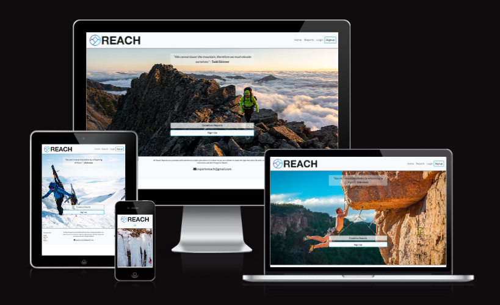
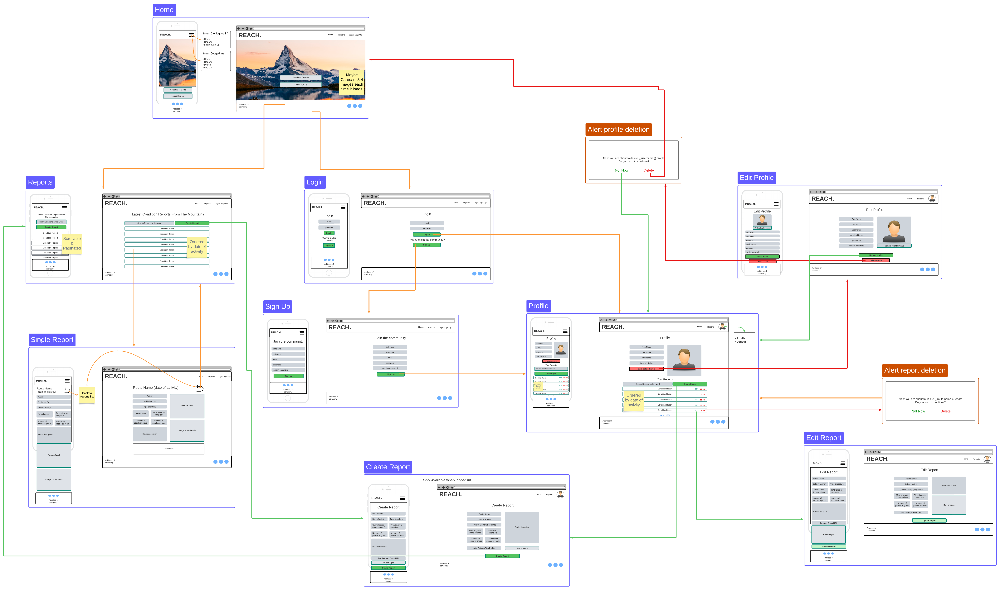
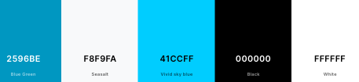
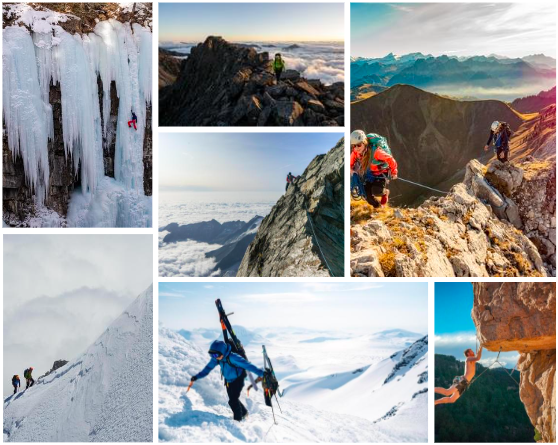

# REACH
### Condition reports from the mountains, written by climbers, for climbers.

## Live Site
[Hosted on Heroku](https://reach-reports-e02886ddeda3.herokuapp.com/)

## Repository
[Github Repo](https://github.com/mtmanning93/Reach_reports)

## Introduction

Reach is a website where users have the abiltiy to create and post condition reports from their climbing adventures and expeditions. Non registered users have the ability to read reports and comments. Registered users have full CRUD functionailty over their reports, along with extra features, such as, commenting and liking other users reports.

## Built With:
Django, Python, JavaScript, Bootstrap 5.2, CSS, HTML

### Includes:
Cloudinary, Crispy Forms

## Contents

- [REACH](#reach)
    - [Live Site](#live-site)
    - [Repository](#repository)
    - [Introduction](#introduction)
    - [Built With](#built-with)
    - [Design Thinking](#design-thinking)
        - [Problem ID](#problem-id)
        - [Problem Statement](#problem-statement)
        - [Brainstorm](#brainstorm)
        - [Site Goals](#site-goals)
    - [UX](#ux-user-experience-design)
        - [User Stories](#user-stories)
            - [Site Admin](#site-admin)
            - [User](#user)
            - [Registered User](#registered-user)
        - [Wireframe](#wireframe)
        - [Information Architecture](#information-architecture)
        - [Visual Design](#visual-design)
            - [Color Scheme](#color-scheme)
            - [Fonts](#fonts)
            - [Imagery](#imagery)
            - [Logo](#logo)
    - [Development](#development)
        - [Agile Design](#agile-design)
            - [Github Isssues](#github-issues)
                - [Templates](#templates)
                - [Labels](#labels)
                - [User Story](#user-story)
                - [Bug Report](#bug-report)
                - [Feature Request](#feature-request)
            - [Product Backlog](#product-backlog)
            - [Iterations](#iterations)
            - [Kanban Board](#kanban-board)
    - [Features](#features)

    - [Technologies Used](#technologies-used)
        - [Django](#django)
        - [Python](#python)
        - [JavaScript](#javascript)
        - [CSS & Bootstrap](#css-&-bootstrap)
        - [Cloudinary](#cloudinary)
    - [Testing](#testing)
        - [Python Testing](#python-testing)
            - [Unit Testing](#unit-tests-automated-testing)
        - [JavaScript Testing](#javascript-testing)
            - [ESLint](#eslint)
        - [CSS Testing](#css-testing)
        - [Html Testing](#html-testing)
        - [User Testing](#user-testing)
    - [Bugs](#bugs)
        - [Resolved Bugs](#resolved)
        - [Unresolved Bugs](#unresolved)
    - [Deployment](#deployment)
        - [Cloudinary Deployment](#cloudinary-deployment)
        - [Elephant SQL DEployment](#elephant-sql-deployment)
        - [Heroku Deployment](#heroku-deployment)
    - [Credits](#credits)
        - [References](#references)
        - [Tools](#tools)
        - [Resources](#resources)

## Design Thinking

### Problem ID

The initial idea arose whilst reading a facebook group post. The group is called the ['Die 48 Schweizer 4000er'](https://www.facebook.com/groups/255829887155). In the post the user expressed their frustration, and having decision fatigue, due to the uncertainty of conditions across the alps on a weekend they wished to climb. They had asked where could they find more information.

Using the 5c's approach it became apparent that having a centralised place where users could read and create reports based on the conditions they had experienced, would solve the problem.

### Problem Statement

> "As a passionate climber, I am trying to climb on my free days, but I'm unsure of the mountain conditions and can't decide whats the best option. This makes me frustrated. How do I find out up to date conditions?"

### Brainstorm

As a passionate alpinist, it was possible to gather a group of climbers and hold a brainstorming session. The sessions provided an insight into what was important to the target audience.

There were 3 key takeaways from the brainstorming session:
    
1. Images Are Important
    - An image says a thousand words, with experience you can tell a lot from an image.
2. Comments
    - A discussion on each report would provide even further information for users.
    - Other user input on each report would create more in depth reports.
3. Key Information
    - Every report should be simple but provide enough information in order to give an insight.
    - Key information such as number of people and an overall grade should be given on all reports.

### Site Goals

#### - User Goals

The user would like the ability to read and post condition updates from recent climbs they have done, or want to do. Providing real and current information from the mountains.

#### - Owners Goals

The goal is to create a discussion and library of up to date condition reports to enable climbers to make easier decisions and ultimately become more successful.

## UX / User Experience Design

### User Stories
----------------
Example user stories which have affected the overall design and functionailty of the project.

#### - Site Admin
> "As a site admin I can create, read, update and delete reports so that I can manage the site content"
>
> "As a site admin I can approve or disapprove comments so that I can keep the content specific and non offensive"

#### - User

> "As a user I can easily locate each page of the site so that navigation is smooth and consistant throughout the site"
>
> "As a user I can view a paginated list of condition reports so that I can select one to read"
>
> "As a user I can select a report from the reports list so that I can read its content"
>
> "As a user I can view comments on each report so that I can see the conversation/ questions"
>
> "As a user I can register for an account so that I can access the functionality to create, comment and like reports myself"

#### - Registered User

> "As a registered user I can create my own report so that I can interact with other climbers"
>
> "As a registered user I can view a list of the reports I have written so that I can select between them to read, edit or delete them"
>
> "As a registered user I can comment on reports so that discuss the report further and join the community"
>
> "As a registered user I can login so that I can take advantage of the registered user functions and view my account"
>
> "As a logged in in user I can log out so that I can protect my account"
>
> "As a logged in  user I can like or unlike posts so that I can show my appreciation towards good reports"
>
> "As a site admin/ registered user I can add images to reports so that the report is more informative"

### Wireframe
-------------

To aid in the design of the UI I created a wireframe. My preference was to create a large wireframe incorporating all pages, to visualise the flow of the website as well as the design. I provided wireframes for, desktop/ laptop and mobile devices, along with the deletion confirmation modals.

Line Key:\
**Green** - Creation or Addition\
**Orange** - Action\
**Red** - Deletion

### Information Architecture
----------------------------

When building the projects wireframe it was important to take into consideration positioning of elements. Across the entire site the user will find consistent layout of a navbar and footer with the main content sandwiched between. Key aspects of the information architecture, found throughout the site are:

- **Site Wide Navbar:**\
The navbar offers the user links to various pages of the site, such as "Home" and "Reports", the consistency of this navigation aids the user in moving easily between different parts of the site, contributing to a better user experience.

- **Branding:**\
Within the navbar is a large brand logo, this allows users to quickly identify the website and helps establish a visual identity.

- **User Authentication:**\
Depending on whether a user is authenticated or not, the navigation options change to "Account" and "Logout" or "Login" and "Signup." This provides a clear path to the users account management.

- **Footer:**\
The footer contains relevant links, including navigation links, social media links, and a contact email. Footers often serve as a secondary navigation or quick access to important sections and resources. Also the footer includes a short safety message to the user helping to connect at a human level.

- **Report Details:**\
The template displays various details about the report. This organized presentation of the reports details allows users to quickly understand key aspects of the report, without having to read large chunks of information.

- **Images and Map:**\
"A picture tells a thousand words". These visual elements enhance the user's understanding of the climbing experience.

### Visual Design
-----------------

#### Color Scheme

The color scheme was chosen to effectively communicate the adventurous and trustworthy aspects of mountaineers and climbers, and therefore the website. The use of blues, combined with the 'bootstrap-light' theme (#F8F9FA) and black text, allows for strong contrast throughout the site. This was very important within the reports details so users can easily read the information provided. The use of white space also aligns well with the outdoor and exploratory theme of the website.

The main colors used throughout the site were:

#### Fonts

I used 2 fonts throughout the site, in different weights, to display hierarchy and guide users. The fonts were chosen due to the versatility and clarity. The two fonts used were; **LATO** for almost all elements, and **Poppins** for added details of lesser importance.

#### Imagery

Across the site I used just nine images. Seven of these are shown as the 'Home' pages main header image. These images were chosen as they cover a wide range of mountainous activites and all convey the main them of the site, adventure. These header images were taken from [Unsplash](https://unsplash.com/) a loyalty free high quality image resource.

#### Logo

The sites logo is a simple mountain emblem with bold and capitalised REACH after it. This is immediately visible to a user and allows the user to quickly identify the site, the colors are inkeeping with the sites theme.

## Development

### Agile Design
----------------

Due to the size of the Reach project and the many different parts. It was crucial to adopt an Agile methodology. In a project with many different functionalities it can be easy to move between the tasks, forgetting parts or even leaving them unfinished. With the Agile approach I was able to identify the key components which would build the project, and seperate them into smaller more manageable tasks. Always carrying manual testing to ensure each component was working as expected before moving on to the next task. It enables regular reflection on the project and attention to each technicality.

### Github Issues

#### Templates

Throughout the build I used three templates:
- [User Story](https://github.com/mtmanning93/Reach_reports/blob/main/.github/ISSUE_TEMPLATE/reach-user-story.md)
- [Bug Report](https://github.com/mtmanning93/Reach_reports/blob/main/.github/ISSUE_TEMPLATE/reach-bug-report.md)
- [Feature Request](https://github.com/mtmanning93/Reach_reports/blob/main/.github/ISSUE_TEMPLATE/reach-feature-request-form.md)

#### Labels

When beginning the process of creating the user stories I introduced 4 labels using the MoSCoW principle. The labels were used when assessing each iteration, meaning they were not static from the beginning, they were reassigned when necessary to adjust the level of importance, of the user story, throughout the overall project. These labels were:
- Must Have
- Should Have
- Could Have
- Wont have

As the project grew it was important to introduce more labels to assign in arrising situations. The additional labels were:
- Bug
- Improvement
- Feature Request

[Project labels](https://github.com/mtmanning93/Reach_reports/labels)

#### User Story

The first template created was the user story template. Every user story includes **Acceptance Criteria** and **Tasks**. The purpose of the user story was to begin the building process and help decide what features would be potentially included.

* **Acceptance Criteria**:
The acceptance criteria for a user story gives a clear indication of what the expected outcome for the user is, it contains no technical information with regards to completing the user story.

* **Tasks**:
Once the user story was created and the acceptance criteria was assigned, the next step was to break it down into smaller tasks, all of which achievable in a day or less. I created the tasks as a checkable list, making it visually clear, whilst developing the project, what the next step was.

[Issues list](https://github.com/mtmanning93/Reach_reports/issues?q=is%3Aissue+is%3Aclosed)

[Example user story](https://github.com/mtmanning93/Reach_reports/issues/16)

#### Bug Report

The next issue template created was the bug report. As the project grew I was constantly carrying out manual testing to check the functionailty of the component being built. Whilst doing so, occassionally, I would notice bugs in other components of the site. In order to keep the flow of the agile method I would create bug reports and add them to the list of issues. The bug reports were then addressed when the priority to do so was high, for example, when labelled a 'Must Have' within the current iteration.

If it was a bug within the current user story task I would assign the label 'Bug' to it.

[Example of assigning the 'Bug' label](https://github.com/mtmanning93/Reach_reports/issues/22)
 
[Example full Bug Report](https://github.com/mtmanning93/Reach_reports/issues/32)

#### Feature Request

The final template created was a feature request. Whilst building the project and showing others a new component, a new idea for a feature would come to mind. Some ideas would be a great addition to the current deployed version of the site whereas others would be great in a later version. All feature requests were labelled with the 'Feature Request' label and/or 'Improvement' depending on the implementation of the idea.

[Example Feature Request](https://github.com/mtmanning93/Reach_reports/issues/29)

### Product Backlog

When a new issue was created, no matter which the template was used, it was added to the Reach Product Backlog. In here it was prioritized and labels were assigned or reassigned accordingly. This process or reassigning labels continued throughout the build as the importance of certain components or bugs would change. As iterations were created the issues would be moved from the product backlog and into the relevant iteration.

[Reach Product Backlog](https://github.com/mtmanning93/Reach_reports/milestone/1)

### Iterations

In order to manage the complexity of the project I implemented the use of iterations using the issue milestones in GitHub. The use of iterations meant I could breakdown the project and provide incremental delivery. This would help to provide clear feeback on progress throughout.

Each iteration was created with a due date. This was to allow for adaptations throughout. An example would be that if a user story was not complete before the iterations due date it was returned to the product backlog for review of its importance, then reprioritized accordingly.

A great effect that working in iterations has is it maintains a steady pace of work, keeps momentum, and keeps the development team motivated. This is due to the constant assessment of progress.

[Project iterations](https://github.com/mtmanning93/Reach_reports/milestones?state=closed)

### Kanban Board

To help the visualisation of tasks in the project I implemented a Kanban board, using GitHub projects. The board was seperated into 3 columns; To Do, In Progress, and Done. All issues in the backlog were automatically added to the Kanban 'To Do' column. Throughout the build I would take all issues from the current iteration into the 'In Progress' column. Once all tasks were completed in the issue I would move the issue over to the 'Done' column. 

When possible I would close an issue from the terminal using the `close #10` command from inside a commit message. This would automatically move the issue into the 'Done' column.

[Reach Kanban Board](https://github.com/users/mtmanning93/projects/7)

## Features

## Technologies Used

### Django:

Django was used as the core framework during this project, its documentation is second to none and it provides the user with a batteries included framework making the development of larger scale sites faster.

[Full Django documentation](https://docs.djangoproject.com/en/3.2/)

#### `django-allauth`
I used django-allauth django add-on in the project, as it provides a set of views, templates, and functionality which integrate with any Django project to handle user authentication, registration, password management. Aiding in the speed of the development process.

To install allauth in the command line:

    pip install django-allauth

Next add to your settings:

    INSTALLED_APPS = [
    'allauth',
    'allauth.account',
    ]

[Link to allauth docs](https://django-allauth.readthedocs.io/en/latest/)

### Python:

I used python for the main logic and functionality of the site, within python I used other packages.

#### `Crispy Forms`

Crispy forms allows your django forms to be styled with bootstrap. As my project was using bootstrap already it made sense to have a uniformed styling.

To install crispy-forms in the command line:

    pip install django-crispy-forms

Next add to your settings:

    INSTALLED_APPS = [
        'crispy_forms',
    ]

    CRISPY_TEMPLATE_PACK = 'bootstrap5'

[Crispy Forms Docs](https://django-crispy-forms.readthedocs.io/en/latest/)

#### `Coverage`

Coverage allowed me to visually check how much of my python code was tested in my unit tests. It provides reports and html documents to check which lines need to be tested.

To install crispy-forms in the command line:

    pip install coverage

Then to run coverage in the command line:

    coverage run --source=app_name manage.py test
    coverage report
    coverage html
    python3 -m http.server

[Coverage Docs](https://pypi.org/project/coverage/)

### JavaScript

During the build very little javascript was necessary, this was mostly due to the use of `Bootstrap 5.2` which includes a large amount of built in javascript functionality such as tool tips, navbars and modals.

In order to include Bootstraps JavScript functionality include this script tag:

    

### CSS & Bootstrap

As mentioned above `Bootstrap 5.2` was used heavily in this project to provide styling and some JavaScript functionality. The beauty of bootstrap is it aso aids in the responsiveness of the site. Given clear breakpoints to work from. In the instance of XS screens I need to create a new breakpoint myself but the use of `Bootstrap` keeps custom css minimal.

In order to include Bootstrap5 include this CDN link:

    <link href="https://cdn.jsdelivr.net/npm/bootstrap@5.2.3/dist/css/bootstrap.min.css" rel="stylesheet"
        integrity="sha384-rbsA2VBKQhggwzxH7pPCaAqO46MgnOM80zW1RWuH61DGLwZJEdK2Kadq2F9CUG65" crossorigin="anonymous">

[Bootstrap 5.2 docs](https://getbootstrap.com/docs/5.2/getting-started/introduction/)

### Cloudinary

The primary use of cloudinary in this project was to upload and destroy stored images. Of course with a number of users storage would quickly fill up therefore it was important to limit the number of images a user can add to each report. Users can add 12 images to a report. Even within the edit report where users can add and delte images at the same time it is only possible to have a total of 12 images connected to the report object.

Once set up you must import cloudinary in your file:

    import cloudinary
    or
    from cloudinary.models import CloudinaryField

I also used cloudinary in my ImageFile model using:

    image_file = CloudinaryField('image', default='placeholder')

[Cloudinary Docs](https://cloudinary.com/documentation)

## Testing

### Python Testing
------------------
#### - Unit Tests (automated testing)
- coverage 100%

### JavaScript Testing
----------------------
#### ESLint

I tested the JavaScript file using ESLint. After running the tests initally there were 3 errors, regarding the use of global variables. ESLint isnt aware of project file structure so I needed to update the settings within the `.eslintrc.json` file. Once this was done and used variables was specified the `script.js` file **passed** all tests with 0 errors.

To install ESLint in the terminal:

    npm install eslint --save-dev

The addition to the `.eslintrc.json` file:

    "globals": {
        "bootstrap": true
    },

[ESLint Docs](https://eslint.org/docs/latest/use/getting-started#prerequisites)

### CSS Testing
---------------
#### W3C Validator

### Html Testing
----------------
#### W3C Validator

### User Testing
----------------

## Bugs

### Resolved

### Unresolved

## Deployment

### Cloudinary Deployment

### Elephant SQL Deployment

### Heroku Deployment

## Credits

### References

### Tools

### Resources