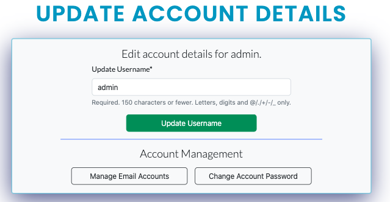
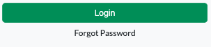
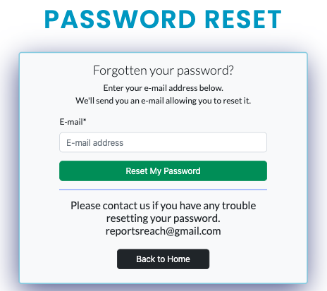
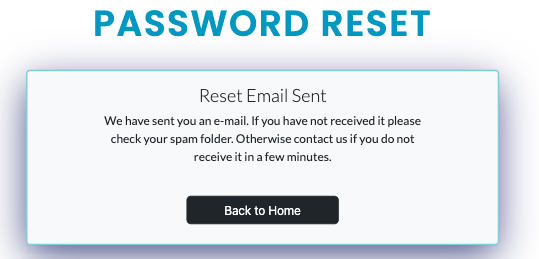
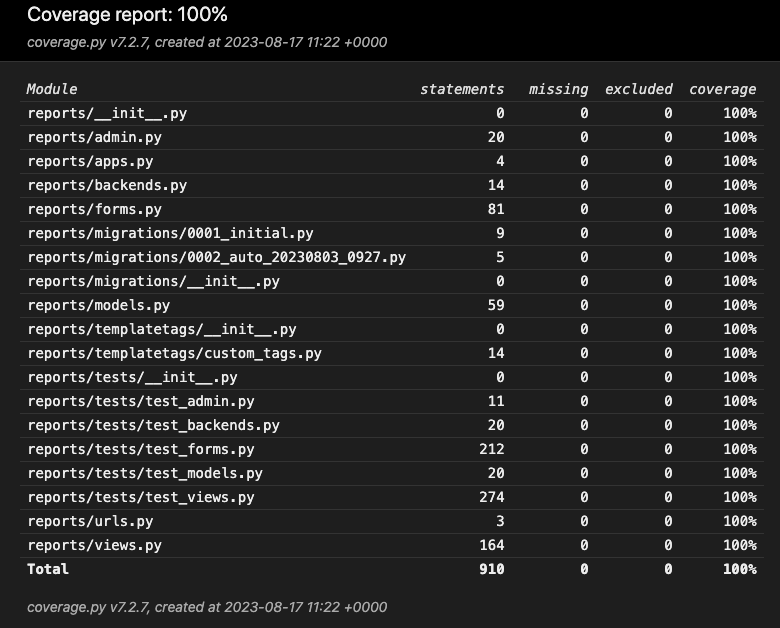
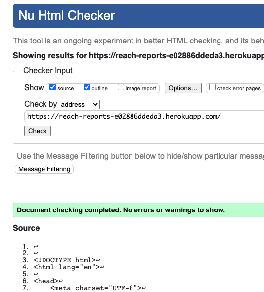

# REACH
### Condition reports from the mountains, written by climbers, for climbers.

## Live Site
[Hosted on Heroku](https://reach-reports-e02886ddeda3.herokuapp.com/)

## Repository
[Github Repo](https://github.com/mtmanning93/Reach_reports)

## Introduction

Reach is a website where users have the abiltiy to create and post condition reports from their climbing adventures and expeditions. Non registered users have the ability to read reports and comments. Registered users have full CRUD functionailty over their reports, along with extra features, such as, commenting and liking other users reports.

## Getting Started
To get started with deploying the project locally, visit this link below:

[Github Cloning](#github-cloning)

## Built With:
Django, Python, JavaScript, Bootstrap 5.2, CSS, HTML

### Includes:
Cloudinary, Crispy Forms

## Contents

- [REACH](#reach)
    - [Live Site](#live-site)
    - [Repository](#repository)
    - [Introduction](#introduction)
    - [Getting Started](#getting-started)
    - [Built With](#built-with)
    - [Design Thinking](#design-thinking)
        - [Problem ID](#problem-id)
        - [Problem Statement](#problem-statement)
        - [Brainstorm](#brainstorm)
        - [Site Goals](#site-goals)
    - [UX](#ux-user-experience-design)
        - [User Stories](#user-stories)
            - [Site Admin](#site-admin)
            - [User](#user)
            - [Registered User](#registered-user)
        - [Wireframe](#wireframe)
        - [Information Architecture](#information-architecture)
        - [Visual Design](#visual-design)
            - [Color Scheme](#color-scheme)
            - [Fonts](#fonts)
            - [Imagery](#imagery)
            - [Logo](#logo)
    - [Development](#development)
        - [Agile Design](#agile-design)
            - [Github Isssues](#github-issues)
                - [Templates](#templates)
                - [Labels](#labels)
                - [User Story](#user-story)
                - [Bug Report](#bug-report)
                - [Feature Request](#feature-request)
            - [Product Backlog](#product-backlog)
            - [Iterations](#iterations)
            - [Kanban Board](#kanban-board)
    - [Features](#features)
        - [Current Features](#current-features)
            - [Navbar](#navbar)
            - [Footer](#footer)
            - [Home](#home)
            - [Reports](#reports)
            - [Reports Details](#report-details)
                - [Information](#information)
                - [Images](#images)
                - [Fatmap iFrame](#fatmap-iframe)
                - [Likes](#likes)
                - [Comments](#comments)
            - [Create Report](#create-report)
            - [Edit Report](#edit-report)
            - [Account Page](#account)
                - [Edit/ Delete Account Link](#edit-delete-account-link)
                - [Admin Site](#admin-site-staff-users-only)
                - [Edit/ Delete Report Links](#edit-delete-report-links)
            - [Update Account](#update-account)
            - [404/ 500 Errors](#404-500-errors)
            - [Reset Password](#reset-password)
            - [Login](#login)
            - [Logout](#logout)
            - [Signup](#signup)
        - [Future Features](#future-features)
    - [Technologies Used](#technologies-used)
        - [Django](#django)
        - [Python](#python)
        - [JavaScript](#javascript)
        - [CSS & Bootstrap](#css-&-bootstrap)
        - [Cloudinary](#cloudinary)
    - [Testing](#testing)
        - [Python Testing](#python-testing)
            - [Unit Testing](#unit-tests-automated-testing)
            - [Coverage](#coverage)
            - [Linters](#linters)
        - [JavaScript Testing](#javascript-testing)
            - [ESLint](#eslint)
        - [CSS Testing](#css-testing)
        - [User Testing](#user-testing)
        - [Manual Testing](#manual-testing)
        - [Screen Testing](#screen-testing)
        - [Browser Testing](#browser-testing)
        - [Lighthouse](#lighthouse)
    - [Bugs](#bugs)
        - [Resolved Bugs](#resolved)
        - [Unresolved Bugs](#unresolved-bugs)
    - [Deployment](#deployment)
        - [Github Cloning](#github-cloning)
        - [Cloudinary Deployment](#cloudinary-deployment)
        - [Elephant SQL DEployment](#elephant-sql-deployment)
        - [Heroku Deployment](#heroku-deployment)
    - [Credits](#credits)
        - [Tools](#tools)
        - [Resources](#resources)
        - [Tutorials](#tutorials)

## Design Thinking

### Problem ID

The initial idea arose whilst reading a facebook group post. The group is called the ['Die 48 Schweizer 4000er'](https://www.facebook.com/groups/255829887155). In the post the user expressed their frustration, and having decision fatigue, due to the uncertainty of conditions across the alps on a weekend they wished to climb. They had asked where could they find more information.

Using the 5c's approach it became apparent that having a centralised place where users could read and create reports based on the conditions they had experienced, would solve the problem.

### Problem Statement

> "As a passionate climber, I am trying to climb on my free days, but I'm unsure of the mountain conditions and can't decide whats the best option. This makes me frustrated. How do I find out up to date conditions?"

### Brainstorm

As a passionate alpinist, it was possible to gather a group of climbers and hold a brainstorming session. The sessions provided an insight into what was important to the target audience.

There were 3 key takeaways from the brainstorming session:
    
1. Images Are Important
    - An image says a thousand words, with experience you can tell a lot from an image.
2. Comments
    - A discussion on each report would provide even further information for users.
    - Other user input on each report would create more in depth reports.
3. Key Information
    - Every report should be simple but provide enough information in order to give an insight.
    - Key information such as number of people and an overall grade should be given on all reports.

### Site Goals

#### - User Goals

The user would like the ability to read and post condition updates from recent climbs they have done, or want to do. Providing real and current information from the mountains.

#### - Owners Goals

The goal is to create a discussion and library of up to date condition reports to enable climbers to make easier decisions and ultimately become more successful.

[⏫ contents](#contents)

## UX / User Experience Design

### User Stories
----------------
Example user stories which have affected the overall design and functionailty of the project.

#### - Site Admin
> "As a site admin I can create, read, update and delete reports so that I can manage the site content"
>
> "As a site admin I can approve or disapprove comments so that I can keep the content specific and non offensive"

#### - User

> "As a user I can easily locate each page of the site so that navigation is smooth and consistant throughout the site"
>
> "As a user I can view a paginated list of condition reports so that I can select one to read"
>
> "As a user I can select a report from the reports list so that I can read its content"
>
> "As a user I can view comments on each report so that I can see the conversation/ questions"
>
> "As a user I can register for an account so that I can access the functionality to create, comment and like reports myself"

#### - Registered User

> "As a registered user I can create my own report so that I can interact with other climbers"
>
> "As a registered user I can view a list of the reports I have written so that I can select between them to read, edit or delete them"
>
> "As a registered user I can comment on reports so that discuss the report further and join the community"
>
> "As a registered user I can login so that I can take advantage of the registered user functions and view my account"
>
> "As a logged in in user I can log out so that I can protect my account"
>
> "As a logged in  user I can like or unlike posts so that I can show my appreciation towards good reports"
>
> "As a site admin/ registered user I can add images to reports so that the report is more informative"

### Wireframe
-------------

To aid in the design of the UI I created a wireframe. My preference was to create a large wireframe incorporating all pages, to visualise the flow of the website as well as the design. I provided wireframes for, desktop/ laptop and mobile devices, along with the deletion confirmation modals.

Line Key:\
**Green** - Creation or Addition\
**Orange** - Action\
**Red** - Deletion

### Information Architecture
----------------------------

When building the projects wireframe it was important to take into consideration positioning of elements. Across the entire site the user will find consistent layout of a navbar and footer with the main content sandwiched between. Key aspects of the information architecture, found throughout the site are:

- **Site Wide Navbar:**\
The navbar offers the user links to various pages of the site, such as "Home" and "Reports", the consistency of this navigation aids the user in moving easily between different parts of the site, contributing to a better user experience.

- **Branding:**\
Within the navbar is a large brand logo, this allows users to quickly identify the website and helps establish a visual identity.

- **User Authentication:**\
Depending on whether a user is authenticated or not, the navigation options change to "Account" and "Logout" or "Login" and "Signup." This provides a clear path to the users account management.

- **Footer:**\
The footer contains relevant links, including navigation links, social media links, and a contact email. Footers often serve as a secondary navigation or quick access to important sections and resources. Also the footer includes a short safety message to the user helping to connect at a human level.

- **Report Details:**\
The template displays various details about the report. This organized presentation of the reports details allows users to quickly understand key aspects of the report, without having to read large chunks of information.

- **Images and Map:**\
"A picture tells a thousand words". These visual elements enhance the user's understanding of the climbing experience.

### Visual Design
-----------------

#### Color Scheme

The color scheme was chosen to effectively communicate the adventurous and trustworthy aspects of mountaineers and climbers, and therefore the website. The use of blues, combined with the 'bootstrap-light' theme (#F8F9FA) and black text, allows for strong contrast throughout the site. This was very important within the reports details so users can easily read the information provided. The use of white space also aligns well with the outdoor and exploratory theme of the website.

The main colors used throughout the site were:

#### Fonts

I used 2 fonts throughout the site, in different weights, to display hierarchy and guide users. The fonts were chosen due to the versatility and clarity. The two fonts used were; **LATO** for almost all elements, and **Poppins** for added details of lesser importance.

#### Imagery

Across the site I used just nine images. Seven of these are shown as the 'Home' pages main header image. These images were chosen as they cover a wide range of mountainous activites and all convey the main them of the site, adventure. These header images were taken from [Unsplash](https://unsplash.com/) a loyalty free high quality image resource.

#### Logo

The sites logo is a simple mountain emblem with bold and capitalised REACH after it. This is immediately visible to a user and allows the user to quickly identify the site, the colors are inkeeping with the sites theme.

[⏫ contents](#contents)

## Development

### Agile Design
----------------

Due to the size of the Reach project and the many different parts. It was crucial to adopt an Agile methodology. In a project with many different functionalities it can be easy to move between the tasks, forgetting parts or even leaving them unfinished. With the Agile approach I was able to identify the key components which would build the project, and seperate them into smaller more manageable tasks. Always carrying manual testing to ensure each component was working as expected before moving on to the next task. It enables regular reflection on the project and attention to each technicality.

### Github Issues

#### Templates

Throughout the build I used three templates:
- [User Story](https://github.com/mtmanning93/Reach_reports/blob/main/.github/ISSUE_TEMPLATE/reach-user-story.md)
- [Bug Report](https://github.com/mtmanning93/Reach_reports/blob/main/.github/ISSUE_TEMPLATE/reach-bug-report.md)
- [Feature Request](https://github.com/mtmanning93/Reach_reports/blob/main/.github/ISSUE_TEMPLATE/reach-feature-request-form.md)

#### Labels

When beginning the process of creating the user stories I introduced 4 labels using the MoSCoW principle. The labels were used when assessing each iteration, meaning they were not static from the beginning, they were reassigned when necessary to adjust the level of importance, of the user story, throughout the overall project. These labels were:
- Must Have
- Should Have
- Could Have
- Wont have

As the project grew it was important to introduce more labels to assign in arrising situations. The additional labels were:
- Bug
- Improvement
- Feature Request

[Project labels](https://github.com/mtmanning93/Reach_reports/labels)

#### User Story

The first template created was the user story template. Every user story includes **Acceptance Criteria** and **Tasks**. The purpose of the user story was to begin the building process and help decide what features would be potentially included.

* **Acceptance Criteria**:
The acceptance criteria for a user story gives a clear indication of what the expected outcome for the user is, it contains no technical information with regards to completing the user story.

* **Tasks**:
Once the user story was created and the acceptance criteria was assigned, the next step was to break it down into smaller tasks, all of which achievable in a day or less. I created the tasks as a checkable list, making it visually clear, whilst developing the project, what the next step was.

[Issues list](https://github.com/mtmanning93/Reach_reports/issues?q=is%3Aissue+is%3Aclosed)

[Example user story](https://github.com/mtmanning93/Reach_reports/issues/16)

#### Bug Report

The next issue template created was the bug report. As the project grew I was constantly carrying out manual testing to check the functionailty of the component being built. Whilst doing so, occassionally, I would notice bugs in other components of the site. In order to keep the flow of the agile method I would create bug reports and add them to the list of issues. The bug reports were then addressed when the priority to do so was high, for example, when labelled a 'Must Have' within the current iteration.

If it was a bug within the current user story task I would assign the label 'Bug' to it.

[Example of assigning the 'Bug' label](https://github.com/mtmanning93/Reach_reports/issues/22)
 
[Example full Bug Report](https://github.com/mtmanning93/Reach_reports/issues/32)

#### Feature Request

The final template created was a feature request. Whilst building the project and showing others a new component, a new idea for a feature would come to mind. Some ideas would be a great addition to the current deployed version of the site whereas others would be great in a later version. All feature requests were labelled with the 'Feature Request' label and/or 'Improvement' depending on the implementation of the idea.

[Example Feature Request](https://github.com/mtmanning93/Reach_reports/issues/29)

### Product Backlog

When a new issue was created, no matter which the template was used, it was added to the Reach Product Backlog. In here it was prioritized and labels were assigned or reassigned accordingly. This process or reassigning labels continued throughout the build as the importance of certain components or bugs would change. As iterations were created the issues would be moved from the product backlog and into the relevant iteration.

[Reach Product Backlog](https://github.com/mtmanning93/Reach_reports/milestone/1)

### Iterations

In order to manage the complexity of the project I implemented the use of iterations using the issue milestones in GitHub. The use of iterations meant I could breakdown the project and provide incremental delivery. This would help to provide clear feeback on progress throughout.

Each iteration was created with a due date. This was to allow for adaptations throughout. An example would be that if a user story was not complete before the iterations due date it was returned to the product backlog for review of its importance, then reprioritized accordingly.

A great effect that working in iterations has is it maintains a steady pace of work, keeps momentum, and keeps the development team motivated. This is due to the constant assessment of progress.

[Project iterations](https://github.com/mtmanning93/Reach_reports/milestones?state=closed)

### Kanban Board

To help the visualisation of tasks in the project I implemented a Kanban board, using GitHub projects. The board was seperated into 3 columns; To Do, In Progress, and Done. All issues in the backlog were automatically added to the Kanban 'To Do' column. Throughout the build I would take all issues from the current iteration into the 'In Progress' column. Once all tasks were completed in the issue I would move the issue over to the 'Done' column. 

When possible I would close an issue from the terminal using the `close #10` command from inside a commit message. This would automatically move the issue into the 'Done' column.

[Reach Kanban Board](https://github.com/users/mtmanning93/projects/7)

[⏫ contents](#contents)

## Features

## Current Features

### Navbar
----------
The navbar is simple yet functional, it contains a large logo which makes the site identifiable immediately, the logo is clickable bringing the user to the 'home' page. The nav links are easily distinguishable. 

When an unregistered user is on the site the nav link options will simply be 'home', 'reports', 'login' and 'signup'. The singup is highlighted as that is what the site wants from an unregistered user.

If a logged in, registered user is viewing the navbar they will see their username as a dropdown link. Once clicked the dropdown menu reveals links to 'account' and logout. In addition if the registered user is a 'staff' member they have access to an extra link 'Admin'. This extra link provides access to the django admin panel.

Unregistered User Navbar Screenshots

Registered User Navbar Screenshots

### Footer
----------
The footer again is simple, providing extra navigation links, social links, a friendly safety message and the contact email address. The navigation links are corresponding to the links in the navbar (updating depending on the users role). The social links open in new tabs when clicked, all links highlight on hover. The footer collapses nicely on itself on smaller screens.

Footer Screenshots

### Home
--------
The 'home' page has a bold and simple design, using large landscape imagery. The images are of different mountain activites, relating to the target audience, and the sites image; motivating and adventurous. The images are selected at random each time the page loads giving users a fun experience. Over the images is an inspring mountain quote which also is chosen at random on page load. More functionality is provided by 2 large buttons. The buttons link to the 'reports' list page and to the 'signup' page for unregistered users, whilst linking to 'create report' page for registered users.

Home Page Screenshots

Home Page Unregistered User Screenshots

### Reports
-----------
The reports page is the main reports list. Here users will find all reports. They are able to select a report from the list, filter the list by 'overall condition grade' or 'activity type'. There also a 'create report' button for ease of access.

Each report object in the list is constructed of key information to enable a user to decide if they wish to read further or not. Each one is implemented as a large clickable button making selection easy.

Reports Page Screenshots

### Report Details
------------------

The 'route name' and 'activity start date' are clearly visible in bold at the top of the page, along with a return button which takes users back to the reports list page.

Report Details Screenshots

#### Information

The reports detail page shows the relevant information from each report object. After the design thinking stage of the project it was clear which pieces of information were valuable to every report. All required fields in the 'Create Report Form' are shown whilst the fields which arent required are only shown when a value is given.

Report Information Screenshot

#### Images

The images section displays all images related to the report seperately in a thumbnail. If clicked they open a modal with an enlarged version of the image inside. Within the modal users can return via one of the 'x' or 'close' buttons or alternatively clicking outside the modal.

Report Images and Modal Screenshots

#### Fatmap Iframe

User have the option to include a [Fatmap.com](https://fatmap.com/adventures/@46.5668314,8.0031898,6596.4744211,-20.0370673,139.3104485,3570.3534546,satellite) url in the report. If they have included one it will appear in the report under the images section. The map is fully interactive, user can move the 3D map using their mouse. Alternatively they can click the map to go to the official site for an enlarged version.

#### Likes

Each report has a 'like' button. A registered user can click it to like a report. The same user can click the same button to then unlike the report. The thumbs up icon changes color when liked. Providing user feeback the likes counter next to it will also increment or decrement accordingly.

If an unregistered user attempts to click the like button a tooltip shows suggesting them to register in order to like and comment.

#### Comments

Finally every report has a comment section, all users can read comments. However only accessible to registered users is the ability to post a comment. Additionally the user can delete only their own comments from the site using the 'x' button. Of course this action requires confirmation from the modal. Each comment posted includes the authors username, content, and date created.

Comment Section Screenshots

Comment Section Unregistered User Screenshots

[⏫ contents](#contents)

### Create Report
-----------------

The main form on the site is found on the 'Create Report' page accessible only as a logged in, registered user. In this form users can provide the information to create their own reports for the site. The form has a minimum requirement, meaning a report cant be created without these pieces of information. This creates a uniformed report site wide, giving regular users easier reading and faster understanding of each condition report. 

Optionally users can add images and a fatmap url to enhance the reports use. Users are however limited to 12 images per report, as they are made aware in the images section.

If a user enters too little or wrong information the report will not be saved or posted to the site and they will be made visually aware of the issues in the report creation.

To submit the form they must click the large green button which is carried throughout the site for creative actions.

Create Report Form Screenshots

### Edit Report
---------------

The edit report page inherits most of its functionailty and features from the create report page. The main feature and difference with this page is users are able to delete and add new images to their report. The logic ensures that the total images is never more than 12. If the user attempts to have more than 12 even through adding and delting at the same time the form is considered invalid. If the form is considered invallid no action happens on the images.

To delete images from the report a user just needs to check the box underneath the image, then when submitting the form the selected images will be deleted.

Edit Report Full Screenshot

### Account
-----------

The account page is the where the user can manage their account details and reports. There a large, centered, profile box contiaining the users personal information and no of written reports statistic. Included are 2 links to ['Edit'](#edit-delete-account-link) and ['Delete'](#edit-delete-account-link) their account.

Beneath is the list of the reports written by the user. Each report in the list has similar information to the items on [reports](#reports) page, however, in the account the user can ['Edit'](#edit-report-link) or ['Delete'](#delete-report-link) their reports via links added to the list item.

Account Full Screenshots

#### Edit/ Delete Account Link

Within the personal details the user can find two links, appropriately colored. The blue 'Edit Account' link will lead the user to the ['Update Account'](#update-account) page. The 'Delete Account' link will open a confirmation modal. Inside the modal will be a list of statistics personal to each user. The statistics tell the user how many report they've created, images uploaded and comments left. If confirmed the users account is deleted and they are redirected to the 'home' page.

#### Admin Site (Staff Users Only)

If a user has 'staff' permission they will have an extra buttonin the personal information section, the button links them to the sites admin page. From here they have full CRUD functionality over users, reports, images. They can block users and remove comments and likes from reports.

#### Edit/ Delete Report Links

On each report item in the users personal reports list is an 'Edit' and a 'Delete' link. If a user chooses to edit they are redirected to the 'edit report' page, whilst if they select 'delete' the confirm deletion modal appears, if confirmed the report is deleted and they're returned to their account page.

### Update Account
------------------

When a user chooses to edit their account from inside the [account](#account) page, they are directed to the 'update account' page. The page contains a simple form where users can update their email or username. Also available to user is to change their password via the ['Reset Account Password'](#reset-password) button, when clicked they are directed to the relevant page.

### 404/ 500 Errors
-------------------

Custom error handlers with a simple back to home button provide a better user experience.

### Reset Password
------------------

Users are able to reset their password in case they have forgotten it prior to login or from inside the ['Update Account'](#update-account) page. The user is taken through the steps in order to change their password, they must provide an email in order to recieve a momentary link (3 days). When clicked they're able to input a new password. Once the steps are complete the user is directed to the Login page.

Password Reset Screenshots

### Login
---------

When created the site Django automatically sets the login conifgured to username and password although I preferred the email and password approach as it ensures users have a working email address for the ['Password Reset'](#reset-password) functions. Now when users login they must enter a password and username is not required. Also non registered users can find a link to the ['Signup'](#signup) page underneath the login form in case they navigated wrongly.

### Logout
----------

Users need to logout in order t protect their accounts. They can do this from inside the navbar by clicking their username, then the 'logout' link in the dropdown menu. Of course users must first confirm their choice in the 'Logout' confirmation page. If confirmed they are redirected to the 'home' page.

### Signup
----------

Non-registered users can navigate to the 'Signup' page. Here they must fill out the forms required fields in order to create an account. If the form is valid the user is directed to their new ['account page'](#account). Additionally if the user has already registered an account with the same email or username the relevant error messages are shown and the user must enter a different username or email.

## Future Features

Whilst building the project new ideas perfect for future releases would come to mind. To stay productive and on track with the current build, I created a [Feature Request Form](#feature-request) using GitHub issues. This meant I could save the ideas for later. Their are still some features in the [Product Backlog](#product-backlog) which would be a great addition to the site at a later point. These features are now marked as ['Wont Do'](#labels) as for this release they aren't of high priority.

[Link To Current 'Wont Dos'](https://github.com/mtmanning93/Reach_reports/issues?q=is%3Aissue+label%3A%22Wont+Have%22+is%3Aopen)
[Link To Left Feature Requests](https://github.com/mtmanning93/Reach_reports/issues?q=is%3Aopen+is%3Aissue+label%3A%22Feature+Request%22)

[⏫ contents](#contents)

## Technologies Used

### Django:

Django was used as the core framework during this project, its documentation is second to none and it provides the user with a batteries included framework making the development of larger scale sites faster.

[Full Django documentation](https://docs.djangoproject.com/en/3.2/)

#### `django-allauth`
I used django-allauth django add-on in the project, as it provides a set of views, templates, and functionality which integrate with any Django project to handle user authentication, registration, password management. Aiding in the speed of the development process.

To install allauth in the command line:

    pip install django-allauth

Next add to your settings:

    INSTALLED_APPS = [
    'allauth',
    'allauth.account',
    ]

[Link to allauth docs](https://django-allauth.readthedocs.io/en/latest/)

### Python:

I used python for the main logic and functionality of the site, within python I used other packages.

#### `Crispy Forms`

Crispy forms allows your django forms to be styled with bootstrap. As my project was using bootstrap already it made sense to have a uniformed styling.

To install crispy-forms in the command line:

    pip install django-crispy-forms

Next add to your settings:

    INSTALLED_APPS = [
        'crispy_forms',
    ]

    CRISPY_TEMPLATE_PACK = 'bootstrap5'

[Crispy Forms Docs](https://django-crispy-forms.readthedocs.io/en/latest/)

#### `Coverage`

Coverage allowed me to visually check how much of my python code was tested in my unit tests. It provides reports and html documents to check which lines need to be tested.

To install crispy-forms in the command line:

    pip install coverage

Then to run coverage in the command line:

    coverage run --source=app_name manage.py test
    coverage report
    coverage html
    python3 -m http.server

[Coverage Docs](https://pypi.org/project/coverage/)

### JavaScript

During the build very little javascript was necessary, this was mostly due to the use of `Bootstrap 5.2` which includes a large amount of built in javascript functionality such as tool tips, navbars and modals.

In order to include Bootstraps JavScript functionality include this script tag:

    

### CSS & Bootstrap

As mentioned above `Bootstrap 5.2` was used heavily in this project to provide styling and some JavaScript functionality. The beauty of bootstrap is it aso aids in the responsiveness of the site. Given clear breakpoints to work from. In the instance of XS screens I need to create a new breakpoint myself but the use of `Bootstrap` keeps custom css minimal.

In order to include Bootstrap5 include this CDN link:

    <link href="https://cdn.jsdelivr.net/npm/bootstrap@5.2.3/dist/css/bootstrap.min.css" rel="stylesheet"
        integrity="sha384-rbsA2VBKQhggwzxH7pPCaAqO46MgnOM80zW1RWuH61DGLwZJEdK2Kadq2F9CUG65" crossorigin="anonymous">

[Bootstrap 5.2 docs](https://getbootstrap.com/docs/5.2/getting-started/introduction/)

### Cloudinary

The primary use of cloudinary in this project was to upload and destroy stored images. Of course with a number of users storage would quickly fill up therefore it was important to limit the number of images a user can add to each report. Users can add 12 images to a report. Even within the edit report where users can add and delte images at the same time it is only possible to have a total of 12 images connected to the report object.

Once set up you must import cloudinary in your file:

    import cloudinary
    or
    from cloudinary.models import CloudinaryField

I also used cloudinary in my ImageFile model using:

    image_file = CloudinaryField('image', default='placeholder')

[Cloudinary Docs](https://cloudinary.com/documentation)

[⏫ contents](#contents)

## Testing

### Python Testing
------------------
#### Unit Tests (automated testing)

I decided to take on Unit Testing for all python code in the project. After a steep and frustrating learning curve I managed to write **80** tests, including **152** assertions. I am however aware that there is many more tests which could be run to check the logic even further.

*Some resources I used to build knowledge and write tests:*

[Intro Testing Python](https://www.freecodecamp.org/news/an-introduction-to-testing-in-python/#:~:text=First%20you%20need%20to%20create,cases%20of%20your%20function's%20behavior.&text=First%2C%20you%20need%20to%20import,want%20to%20test%2C%20formatted_name()%20.)

[Beginner Tests](https://cferreirasuazo.medium.com/lets-unit-test-django-forms-280704168d1b)

[Django Testing Docs](https://docs.djangoproject.com/en/4.2/topics/testing/tools/)

[Django Advanced Testing](https://docs.djangoproject.com/en/4.2/topics/testing/advanced/)

#### Coverage

Throughout testing I was using `coverage` to test how much of my code was being tested and which statements still needed to be tested. Its an icredibly helpful tool, providing reports in the CLI and even a Html docment, visible from the browser. To avoid even further confusion I seperated my tests into different files, seperating `test_views` from `test_forms` meant I could also focus running tests on just one document or TestCase easier.

After using `coverage` I was able to make **100%** of code covered.

#### Linters

To check for syntax errors in the projects Python code I used `pycodestyle` *(formerly pep8)*. Using this I was able to twst my code from inside the command line. Its a fast and easy way to heck the syntax as it returns the file name and lines of the error.

To install `pycodestyle` in the command line:

    pip install pycodestyle

Then to test the files in the command line:

    pycodestyle python_file.py
    or
    pycodestyle .

When initially running the linter there were a few errors which I addressed and corrected. After these corrections the only errors left were *'E501 line too long'*. These were mostl found in the migration files automatically created during the `makemigration` command. After updating these there were no more errors within my files.

To check I ran in the command line:

    pycodestyle reports
    pycodestyle reach
    pycodestyle . (only errors shown in .vscode files)
 
### JavaScript Testing
----------------------
#### ESLint

I tested the JavaScript file using ESLint. After running the tests initally there were 3 errors, regarding the use of global variables. ESLint isnt aware of project file structure so I needed to update the settings within the `.eslintrc.json` file. Once this was done and used variables was specified the `script.js` file **passed** all tests with 0 errors.

To install ESLint in the terminal:

    npm install eslint --save-dev

The addition to the `.eslintrc.json` file:

    "globals": {
        "bootstrap": true
    },

[ESLint Docs](https://eslint.org/docs/latest/use/getting-started#prerequisites)

### CSS Testing
---------------
#### W3C Validator

I ran the css file through the [W3C CSS Validator](https://jigsaw.w3.org/css-validator/validator#css) and the file passed with no errors. After using `Bootstrap` throughout the project I didnt have too much CSS to test.

### Html Testing
----------------
#### W3C Validator

When initially running the site through the [W3C Html Validator](https://validator.w3.org/nu/?showsource=yes&showoutline=yes&doc=https%3A%2F%2Freach-reports-e02886ddeda3.herokuapp.com%2F), I recieved 2 error messages:

1.  "Element h5 not allowed as child of element ul in this context."
- This error was in the footer of the site, I just needed to move the `<ul>><h5>` from inside to outside the `<ul>` element.

2. "Stray end tag `
`."
- Again in the footer I had an unused closing `
` tag.

With these errors fixed I ran the deployed url again and recieved "Document checking completed. No errors or warnings to show" message.

### User Testing
----------------
These tests were written and given to a user to carry out whilst using the site. They were made to test overall functionailty of the site.

| **Test** | **Expected result** | **Success** | **Final Result** |
| ---- | ------ | ------ | ------ |
| **Navbar** |
| Click logo in navbar | Returns user to landing page | √ | Pass |
| Click 'Home' link in navbar | Returns user to landing page | √ | Pass |
| Click 'Reports' link in navbar | Reports list page opens showing list of all reports | √ | Pass |
| Click 'Login' link in navabar | Opens login page | √ | Pass |
| Click 'Signup' link in navbar | Opens signup page | √ | Pass |
| Click 'Burger' list icon on mobile in navbar | Opens Dropdown menu | √ | Pass |
| **Footer** |
| Click social links in footer | Opens link in newtab to relevant social media site | √ | Pass |
| Click footer nav links | Opens relevant pages | √ | Pass |
| **Home/ Landing page** |
| Load landing page | Page loads | √ | Pass |
| Click 'Condition Reports' button | Reports list page opens showing list of all reports | √ | Pass |
| Click 'Signup' button | Signup page opens | √ | Pass |
| Reload page | New header image and inspiring quote appears at random | √ | Pass |
| **Reports** |
| Click report object | Reports details page opens showing relevant report details | √ | Pass |
| Apply 'activity' filter | Filters report list to show just the chosen activty reports | √ | Pass |
| Apply 'grade' filter | Filters report list to show just the chosen grade reports | √ | Pass |
| Click pagination button (Next/ Prev) | Moves to the next or previous page | √ | Pass |
| Click 'Log in to Create Reports' button | Opens the login page | √ | Pass |
| **Report Details** |
| Click report list "return" button | Returns user to the reports list page | √ | Pass |
| Click report image | Opens modal showing enlarged image | √ | Pass |
| Click outside image modal | Closes modal showing enlarged image | √ | Pass |
| Click one of the close buttons in image modal | Closes modal showing enlarged image | √ | Pass |
| **Liking** |
| Hover like button (not logged in) | Shows tooltip regarding login | √ | Pass |
| Click like button (logged in) | Like icon turns blue and adds to the like count | √ | Pass |
| Click like button again (logged in) | Like icon turns white and removes a like count | √ | Pass |
| **Comments** |
| Write comment and hit post | Reloads the relevant page with new comment and comment count increments | √ | Pass |
| Click delete comment 'X' button | Opens confirm deletion modal | √ | Pass |
| Click 'delete' in modal | Removes comment from report details view | √ | Pass |
| Click 'cancel' in modal | No action, returns user to reportdetails | √ | Pass |
| **Login** |
| Enter valid details and click login | Opens account page with correct user details, shows success alert | √ | Pass |
| Enter invalid details and click login | Form error message is displayed | √ | Pass |
| Click 'signup' button below | Opens signup page | √ | Pass |
| Click 'forgot password' link | Opens password reset page | √ | Pass |
| **Signup** |
| Enter valid details and click signup | Opens account page with new user details | √ | Pass |
| Enter invalid details and click signup | Form error messages displayed | √ | Pass |
| Click 'login' button below | Opens login page | √ | Pass |
| Click 'forgot password' link | Opens password reset page | √ | Pass |
| **Account** |
| Click 'create new report' button | Opens create report page | √ | Pass |
| Click 'edit account' link | Opens update account page | √ | Pass |
| Click 'delete account' link | Opens deletion confirmation modal | √ | Pass |
| Click 'delete' in deletion modal | Deletes account and redirects user to 'home' page | √ | Pass |
| Click 'cancel' in deletion modal | Closes modal and returns user to account page | √ | Pass |
| Click report object title | Opens report details of relevant report | √ | Pass |
| Click report object 'edit' link | Opens edit report page with relevant report details | √ | Pass |
| Click report object 'delete' link | Opens confirm deletion modal | √ | Pass |
| Click 'delete' in deletion modal | Deletes report and redirects user to their 'account' page | √ | Pass |
| Click 'cancel' in deletion modal | Closes modal and returns user to their account page | √ | Pass |
| **Update Account** |
| Update account with valid credentials | Account information updated and returned to account page | √ | Pass |
| Update account with invalid credentials | Form is invalid, corresponding validation error shown | √ | Pass |
| Click 'reset password' button | Opens reset password page | √ | Pass |
| **Logged In User** |
| Click 'username' link in navbar | Opens dropdown including links to account and logout | √ | Pass |
| **Admin & Staff** |
| Click 'username' link in navbar | Opens dropdown including links to account, site control and logout | √ | Pass |
| Click 'site control' link in profile information | Opens django admin panel | √ | Pass |
| **Create Report Form** |
| Fill out form with valid data | Creates report and redirects user to reports list page, shows success alert | √ | Pass |
| Fill out form with invalid data | Shows invalid input validation errors, doesnt submit form | √ | Pass |
| Add more than 12 images to report | Form is invalid, corresponding error message regarding images is shown | √ | Pass |
| Select an 'end_date' before the 'start_date' | Form is invalid, corresponding validation error shown | √ | Pass |
| Select a 'start-date' more than 5 years old | Form is invalid, corresponding validation error shown | √ | Pass |
| Input a 'summit height' as a negative number | Form is invalid, corresponding validation error shown | √ | Pass |
| Input a 'summit height' higher than Everest (8849) | Form is invalid, corresponding validation error shown | √ | Pass |
| Input an invalid duration format in 'time taken' field | Form is invalid, corresponding validation error shown | √ | Pass |
| Input a negative in the 'number in group' field | Form is invalid, corresponding validation error shown | √ | Pass |
| Input a negative in the 'number on route' field | Form is invalid, corresponding validation error shown | √ | Pass |
| Input a number over 50 in 'number in group' field | Form is invalid, corresponding validation error shown | √ | Pass |
| Input a number over 500 'number on route' field | Form is invalid, corresponding validation error shown | √ | Pass |
| Input a valid url in the 'Fatmap link' field  | Form is created, displays a iframe in the report details page | √ | Pass |
| Input an invalid url in the 'Fatmap link' field (doesnt include 'fatmap.com')  | Form is invalid, corresponding validation error shown | √ | Pass |
| **Edit Report Form** |
| Select some images to delete (checkbox), submit | Confirm deletion modal is shown, on confirmaation images are removed from report | √ | Pass |
| Choose a report with images and more images (under 12) | If image count for the report is under 12, images are added | √ | Pass |
| Choose a report with images and more images (over 12) | Form is invalid, corresponding validation error shown, no action on images taken | √ | Pass |
| Choose a report with images and more images (over 12), but also delete images (total under 12) | Image count is checked, deleted images removed and added images added to report | √ | Pass |
| Choose a report with images and more images (over 12), but also delete images (total over 12) | Image count is checked, total images equals too many. No action taken, corresponding error message displayed | √ | Pass |
| Click 'update report' button | If form is valid, user redirected to account page | √ | Pass |
| **Reset Password** |
| Provide valid email, click 'reset my password' button | If email is valid, user receives an email with reset link | √ | Pass |
| Click 'back to home' button | Returns user to home page | √ | Pass |
| Click reset link in email | Opens the reset password link for relevant user | √ | Pass |
| Fill out password reset form, click reset | Opens the reset password updated page, logs out user if logged in | √ | Pass |
| Click 'login' button | Opens login page | √ | Pass |
| **404 & 500 Error** |
| Click 'back to home' button | returns user to home page | √ | Pass |

### Screen Testing
------------------
When designing the app and the UI, responsiveness was key. When the sites main components were in place, I worked on the less responsive parts of the design, using `bootstraps` gridsystem and some custom styling I was able to use Chrome dev tools to implement a responsive design site wide across a range of devices from iPhone 6 to large monitor sized screens.

To further test the app would work across screens I physically tested its appearance across some devices of differeing sizes, these were:

- 24" Monitor
- 12" Square Desktop
- 12" Macbook Air Laptop
- iPad
- Samsung Galaxy s21
- iPhone 7

### Browser Testing
-------------------
The project was developed in Google Chrome using the Gitpod IDE. This made building the project simple as I had access to the Chrome Devtools. It is however not just available in the Chrome browser therefore it was important to test it across a number of different browsers, the browser tests included:

- Chrome
- Firefox
- Safari
- Edge

### Lighthouse
--------------

[⏫ contents](#contents)

## Bugs

When a bug is identified I was able to raise an issue in Github using the [Bug Report Template](#bug-report). As I was building the project I would identify a bug but in order to keep productive I would create a report in order to focus on it at a later time.

[Resolved Bugs](https://github.com/mtmanning93/Reach_reports/issues?q=is%3Aissue+is%3Aclosed+label%3ABug)

### Unresolved Bugs
-------------------

[Unresolved Bug](https://github.com/mtmanning93/Reach_reports/issues?q=is%3Aopen+is%3Aissue+label%3ABug)

When designing the project, even as early as the brainstorming session, it was clear that a [Fatmap](https://fatmap.com/adventures) iframe would be a great addition to the reports. It would provide a wealth of clarity for users regarding the route. Whilst implementing the iframe, and embedding it within a report details page, It would show numerous errors and warnings in the console. Through researching I found that this was unrelated to my project but the errors were actually stemming from the JavaScript in the iframe itself.

I attempted to contact fatmap.com and datahappy.co but neither responding to the issue I had raised.

[⏫ contents](#contents)

## Deployment

### Github Cloning
------------------

### Cloudinary Deployment
-------------------------
I used cloudinary in the project to store all media files, its a really easy set up. To do so follow these steps:

**1. Navigate to the Cloudinary website and register or login.**

**2. Once the login or registration is complete, navigate to the 'Dashboard' page.**

**3. After reaching the dashboard you will find all relevant credentials needed to set up the project with your cloudinary.**

### ElephantSQL Deployment
---------------------------
For this project I decide to use ElephantSQL which uses PostgresSQL databases. In order to set up ElephantSQL follow these steps:

**1. Create an account or Login to your ElephantSQL dashboard and click the green 'Create New Instance' Button.**

**2. Next setup the instance plan, when the form is complete click 'Select Region'.**

Generally the title here is the project title.For my project I selected the 'Tiny Turtle (Free)' plan and left the tags field blank.

**3. Select the data center closest to you from the dropdown list, when selected click 'Review'.**

**4. Check the details are correct and click the green 'Create Instance' button.**

**5. Return to the dashboard and select the new instance just created by clicked on its name.**

**6. This will display all the necessary credentials to connect this project to your database.**

### Heroku Deployment
---------------------
The project was deployed using Heroku. Heroku simplifies the deployment process. With a few commands, you can deploy your application without the need to configure servers, networking, or infrastructure. I chose to deploy my project early on to avoid any nasty surprises at the end of the build, this is a great method and reduces stress as the project is already deployed throughout.

In order to deploy my project to Heroku I folowed these 10 steps:

**1. Navigate to the Heroku dashboard. Click "New" and select "Create new app".**

**2. Create an app name and select a region closest to you.**

**3. Next navigate to the 'Settings' tab, and select 'Reveal Config Vars'.**

**4. Add necessary 'Config Vars'.**

For this project you will need the following 'Config Vars':

- CLOUDINARY_URL: Get from Cloudinary.
- DATABASE_URL: Get from your SQL provider.
- EMAIL_HOST: Get from your email provider.
- GMAIL_ACC: Get from your email provider.
- GMAIL_KEY: Get from your email provider.
- PORT: Set to 8000.
- SECRET_KEY: Django project secret key, generated by your Django project.
- DISABLE_COLLECTSTATIC: Set to 0.

**5. Navigate to the 'Deploy' tab.**

**6. Scroll to 'Deployment Methods' section and select 'Connect to GitHub'.**

**7. Once connected to GitHub, search for the repository in the 'Connect to GitHub' section, click 'Connect'.**

**8. I chose to enable 'Automatic Deploys'. In order to do so click the 'Enable Automatic Deploys' button.**

**9. For manual deployment or to deploy when needed use 'Manual Deploy' section by clicked 'Deploy Branch'.**

**10. Click 'View' at the bottom of the 'Manual Deploy' section to view the deployed site.**

[⏫ contents](#contents)

## Credits
It would be an incredible feat to remember all information needed to build such a project, to a deployable standard. Therfore I am not ashamed to mention some resources were used to aid me in the process, below I have detailed some of the resources used.

### Tools
---------
* [Lucid Chart](https://www.lucidchart.com/pages/): Wireframe and ERD
* [ESLint](https://eslint.org/): JavaScript Testing
* [Coverage](https://coverage.readthedocs.io/en/7.2.7/): To test how much of the project had benn test during unit testing.
* [Google Fonts](https://fonts.google.com/)
* [Favicon.io](https://favicon.io/)
* [Am i Responsive](https://ui.dev/amiresponsive?url=https://reach-reports-e02886ddeda3.herokuapp.com/)

### Resources
-------------
* [Django Documentation](https://docs.djangoproject.com/en/3.2/): The django docs are really extensive and provide a wealth of support, the main uses I found were:
    - Testing
    - Advanced Testing Topics
    - FormFields
    - UpdateView
    - ReverseLazy
    - Custom Template Tags
    - DateInput Widget

* [Form 'Select' input](https://stackoverflow.com/questions/33726759dropdown-select-option-to-filter-a-django-list)

* [Enctype](https://www.geeksforgeeks.org/define-multipart-form-data/): Helped to allow for multi-part form data as my reports forms would also contain images.

* [Bootstrap 5.2 Docs](https://getbootstrap.com/docs/5.2/getting-started/introduction/): Relied on heavily for styling and JavaScript.

* [FontAwesome](https://fontawesome.com/): For all icons found site wide.

* [Jinja Filters](https://jinja.palletsprojects.com/en/3.1.x/templates/#list-of-builtin-filters)

* [Crispy Docs](https://django-crispy-forms.readthedocs.io/en/latest/index.html)\
[Cripsy Bootstrap 5](https://github.com/django-crispy-forms/crispy-bootstrap5): Bootstrap5 form rendering templating

* [Custom Authentication Backend](https://stackoverflow.com/questions/37332190/django-login-with-email): Used to enable email login to override the username input.

* [Email Authenication](https://medium.com/@therealak12/authenticate-using-email-instead-of-username-in-django-rest-framework-857645037bab): Further suport for email login.

### Tutorials
-------------
* [Setup SMTP Tutorial](https://dev.to/abderrahmanemustapha/how-to-send-email-with-django-and-gmail-in-production-the-right-way-24ab): This tutorial helped me to set up the gmail smtp required for the password reset functionality. 

* [Password Reset Tutorial](https://learndjango.com/tutorials/django-password-reset-tutorial): This tutorial also helped to set up the password reset using django-allauth.

* [Edit Object Tutorial](https://openclassrooms.com/en/courses/6967196-create-a-web-application-with-django/7349667-update-a-model-object-with-a-modelform): Helped when creating views to edit model objects.

* [Code Institute LMS:](https://learn.codeinstitute.net/dashboard): I took a great amount of support from the following modules, setup, deployment, and both function and class based views.
    - Agile Development
    - 'I Think Therefore I Blog'
    - 'Hello Django' walkthroughs

[⏫ contents](#contents)