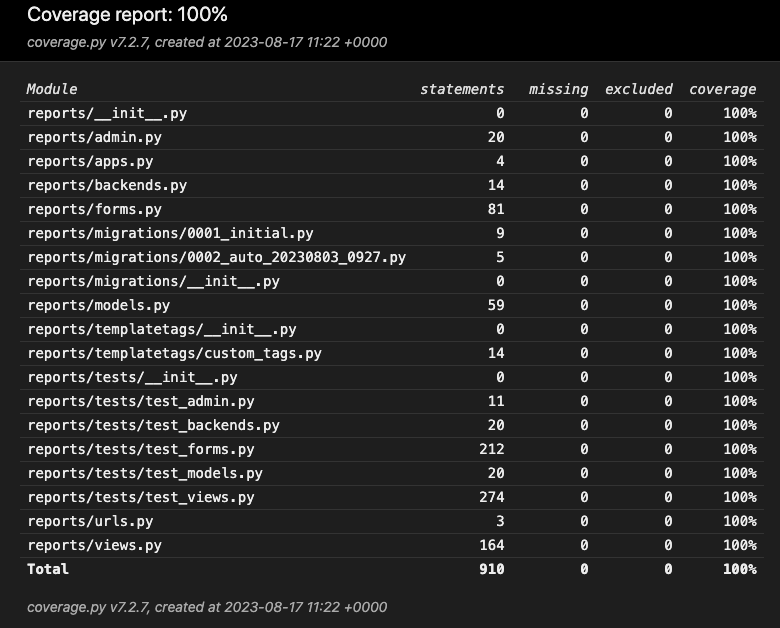
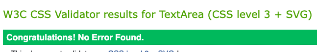
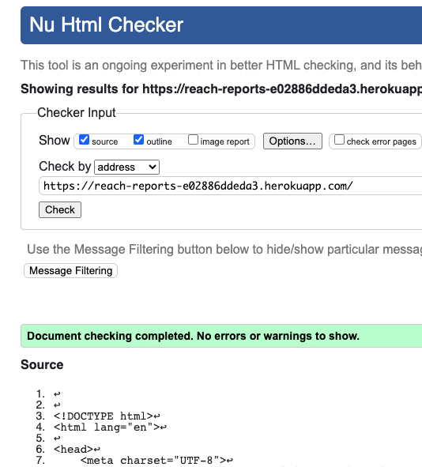

# Testing

## Contents

[⏪ Main README](README.md)

- [Python Testing](#python-testing)
    - [Unit Testing](#unit-tests-automated-testing)
    - [Coverage](#coverage)
    - [Linters](#linters)
- [JavaScript Testing](#javascript-testing)
    - [ESLint](#eslint)
- [CSS Testing](#css-testing)
- [User Testing](#user-testing)
- [Screen Testing](#screen-testing)
- [Browser Testing](#browser-testing)
- [Lighthouse](#lighthouse)

### Python Testing
------------------
#### Unit Tests (automated testing)

I decided to take on Unit Testing for all python code in the project. After a steep and frustrating learning curve I managed to write **81** tests, including **154** assertions. I am however aware that there is many more tests which could be run to check the logic even further.

*Some resources I used to build knowledge and write tests:*

[Intro Testing Python](https://www.freecodecamp.org/news/an-introduction-to-testing-in-python/#:~:text=First%20you%20need%20to%20create,cases%20of%20your%20function's%20behavior.&text=First%2C%20you%20need%20to%20import,want%20to%20test%2C%20formatted_name()%20.)

[Beginner Tests](https://cferreirasuazo.medium.com/lets-unit-test-django-forms-280704168d1b)

[Django Testing Docs](https://docs.djangoproject.com/en/4.2/topics/testing/tools/)

[Django Advanced Testing](https://docs.djangoproject.com/en/4.2/topics/testing/advanced/)

#### Coverage

Throughout testing I was using `coverage` to test how much of my code was being tested and which statements still needed to be tested. Its an icredibly helpful tool, providing reports in the CLI and even a Html docment, visible from the browser. To avoid even further confusion I seperated my tests into different files, seperating `test_views` from `test_forms` meant I could also focus running tests on just one document or TestCase easier.

After using `coverage` I was able to make **100%** of code covered.

To run `coverage` in command line type:

    coverage run --source=reports manage.py test

#### Linters

To check for syntax errors in the projects Python code I used `pycodestyle` *(formerly pep8)*. Using this I was able to twst my code from inside the command line. Its a fast and easy way to heck the syntax as it returns the file name and lines of the error.

To install `pycodestyle` in the command line:

    pip install pycodestyle

Then to test the files in the command line:

    pycodestyle python_file.py
    or
    pycodestyle .

When initially running the linter there were a few errors which I addressed and corrected. After these corrections the only errors left were *'E501 line too long'*. These were mostl found in the migration files automatically created during the `makemigration` command. After updating these there were no more errors within my files.

To check I ran in the command line:

    pycodestyle reports
    pycodestyle reach
    pycodestyle . (only errors shown in .vscode files)

[⏫ contents](#contents)
 
### JavaScript Testing
----------------------
#### ESLint

I tested the JavaScript file using ESLint. After running the tests initally there were 3 errors, regarding the use of global variables. ESLint isnt aware of project file structure so I needed to update the settings within the `.eslintrc.json` file. Once this was done and used variables was specified the `script.js` file **passed** all tests with 0 errors.

To install ESLint in the terminal:

    npm install eslint --save-dev

The addition to the `.eslintrc.json` file:

    "globals": {
        "bootstrap": true
    },

[ESLint Docs](https://eslint.org/docs/latest/use/getting-started#prerequisites)

[⏫ contents](#contents)

### CSS Testing
---------------
#### W3C Validator

I ran the css file through the [W3C CSS Validator](https://jigsaw.w3.org/css-validator/validator#css) and the file passed with no errors. After using `Bootstrap` throughout the project I didnt have too much CSS to test.

### Html Testing
----------------
#### W3C Validator

When initially running the site through the [W3C Html Validator](https://validator.w3.org/nu/?showsource=yes&showoutline=yes&doc=https%3A%2F%2Freach-reports-e02886ddeda3.herokuapp.com%2F), I recieved 2 error messages:

1.  "Element h5 not allowed as child of element ul in this context."
- This error was in the footer of the site, I just needed to move the `<ul>><h5>` from inside to outside the `<ul>` element.

2. "Stray end tag `
`."
- Again in the footer I had an unused closing `
` tag.

With these errors fixed I ran the deployed url again and recieved "Document checking completed. No errors or warnings to show" message.

[⏫ contents](#contents)

### User Testing
----------------
These tests were written and given to a user to carry out whilst using the site. They were made to test overall functionailty of the site.

| **Test** | **Expected result** | **Success** | **Final Result** |
| ---- | ------ | ------ | ------ |
| **Navbar** |
| Click logo in navbar | Returns user to landing page | √ | Pass |
| Click 'Home' link in navbar | Returns user to landing page | √ | Pass |
| Click 'Reports' link in navbar | Reports list page opens showing list of all reports | √ | Pass |
| Click 'Login' link in navabar | Opens login page | √ | Pass |
| Click 'Signup' link in navbar | Opens signup page | √ | Pass |
| Click 'Burger' list icon on mobile in navbar | Opens Dropdown menu | √ | Pass |
| **Footer** |
| Click social links in footer | Opens link in newtab to relevant social media site | √ | Pass |
| Click footer nav links | Opens relevant pages | √ | Pass |
| **Home/ Landing page** |
| Load landing page | Page loads | √ | Pass |
| Click 'Condition Reports' button | Reports list page opens showing list of all reports | √ | Pass |
| Click 'Signup' button | Signup page opens | √ | Pass |
| Reload page | New header image and inspiring quote appears at random | √ | Pass |
| **Reports** |
| Click report object | Reports details page opens showing relevant report details | √ | Pass |
| Apply 'activity' filter | Filters report list to show just the chosen activty reports | √ | Pass |
| Apply 'grade' filter | Filters report list to show just the chosen grade reports | √ | Pass |
| Click pagination button (Next/ Prev) | Moves to the next or previous page | √ | Pass |
| Click 'Log in to Create Reports' button | Opens the login page | √ | Pass |
| **Report Details** |
| Click report list "return" button | Returns user to the reports list page | √ | Pass |
| Click report image | Opens modal showing enlarged image | √ | Pass |
| Click outside image modal | Closes modal showing enlarged image | √ | Pass |
| Click one of the close buttons in image modal | Closes modal showing enlarged image | √ | Pass |
| **Liking** |
| Hover like button (not logged in) | Shows tooltip regarding login | √ | Pass |
| Click like button (logged in) | Like icon turns blue and adds to the like count | √ | Pass |
| Click like button again (logged in) | Like icon turns white and removes a like count | √ | Pass |
| **Comments** |
| Write comment and hit post | Reloads the relevant page with new comment and comment count increments | √ | Pass |
| Click delete comment 'X' button | Opens confirm deletion modal | √ | Pass |
| Click 'delete' in modal | Removes comment from report details view | √ | Pass |
| Click 'cancel' in modal | No action, returns user to reportdetails | √ | Pass |
| **Login** |
| Enter valid details and click login | Opens account page with correct user details, shows success alert | √ | Pass |
| Enter invalid details and click login | Form error message is displayed | √ | Pass |
| Click 'signup' button below | Opens signup page | √ | Pass |
| Click 'forgot password' link | Opens password reset page | √ | Pass |
| **Signup** |
| Enter valid details and click signup | Opens account page with new user details | √ | Pass |
| Enter invalid details and click signup | Form error messages displayed | √ | Pass |
| Click 'login' button below | Opens login page | √ | Pass |
| Click 'forgot password' link | Opens password reset page | √ | Pass |
| **Account** |
| Click 'create new report' button | Opens create report page | √ | Pass |
| Click 'edit account' link | Opens update account page | √ | Pass |
| Click 'delete account' link | Opens deletion confirmation modal | √ | Pass |
| Click 'delete' in deletion modal | Deletes account and redirects user to 'home' page | √ | Pass |
| Click 'cancel' in deletion modal | Closes modal and returns user to account page | √ | Pass |
| Click report object title | Opens report details of relevant report | √ | Pass |
| Click report object 'edit' link | Opens edit report page with relevant report details | √ | Pass |
| Click report object 'delete' link | Opens confirm deletion modal | √ | Pass |
| Click 'delete' in deletion modal | Deletes report and redirects user to their 'account' page | √ | Pass |
| Click 'cancel' in deletion modal | Closes modal and returns user to their account page | √ | Pass |
| **Update Account** |
| Update account with valid username | Account information updated and returned to account page | √ | Pass |
| Update account with invalid username | Form is invalid, corresponding validation error shown | √ | Pass |
| Click 'Change Account Password' button | Opens change password page | √ | Pass |
| Click 'Manage Email Accounts' button | Opens corresponding page | √ | Pass |
| **Logged In User** |
| Click 'username' link in navbar | Opens dropdown including links to account and logout | √ | Pass |
| **Admin & Staff** |
| Click 'username' link in navbar | Opens dropdown including links to account, site control and logout | √ | Pass |
| Click 'site control' link in profile information | Opens django admin panel | √ | Pass |
| **Create Report Form** |
| Fill out form with valid data | Creates report and redirects user to reports list page, shows success alert | √ | Pass |
| Fill out form with invalid data | Shows invalid input validation errors, doesnt submit form | √ | Pass |
| Add more than 12 images to report | Form is invalid, corresponding error message regarding images is shown | √ | Pass |
| Select an 'end_date' before the 'start_date' | Form is invalid, corresponding validation error shown | √ | Pass |
| Select a 'start-date' more than 5 years old | Form is invalid, corresponding validation error shown | √ | Pass |
| Input a 'summit height' as a negative number | Form is invalid, corresponding validation error shown | √ | Pass |
| Input a 'summit height' higher than Everest (8849) | Form is invalid, corresponding validation error shown | √ | Pass |
| Input an invalid duration format in 'time taken' field | Form is invalid, corresponding validation error shown | √ | Pass |
| Input a negative in the 'number in group' field | Form is invalid, corresponding validation error shown | √ | Pass |
| Input a negative in the 'number on route' field | Form is invalid, corresponding validation error shown | √ | Pass |
| Input a number over 50 in 'number in group' field | Form is invalid, corresponding validation error shown | √ | Pass |
| Input a number over 500 'number on route' field | Form is invalid, corresponding validation error shown | √ | Pass |
| Input a valid url in the 'Fatmap link' field  | Form is created, displays a iframe in the report details page | √ | Pass |
| Input an invalid url in the 'Fatmap link' field (doesnt include 'fatmap.com')  | Form is invalid, corresponding validation error shown | √ | Pass |
| **Edit Report Form** |
| Select some images to delete (checkbox), submit | Confirm deletion modal is shown, on confirmaation images are removed from report | √ | Pass |
| Choose a report with images and more images (under 12) | If image count for the report is under 12, images are added | √ | Pass |
| Choose a report with images and more images (over 12) | Form is invalid, corresponding validation error shown, no action on images taken | √ | Pass |
| Choose a report with images and more images (over 12), but also delete images (total under 12) | Image count is checked, deleted images removed and added images added to report | √ | Pass |
| Choose a report with images and more images (over 12), but also delete images (total over 12) | Image count is checked, total images equals too many. No action taken, corresponding error message displayed | √ | Pass |
| Click 'update report' button | If form is valid, user redirected to account page | √ | Pass |
| **Reset Password** |
| Provide valid email, click 'reset my password' button | If email is valid, user receives an email with reset link | √ | Pass |
| Click 'back to home' button | Returns user to home page | √ | Pass |
| Click reset link in email | Opens the reset password link for relevant user | √ | Pass |
| Fill out password reset form, click reset | Opens the reset password updated page, logs out user if logged in | √ | Pass |
| Click 'login' button | Opens login page | √ | Pass |
| **Change Password** |
| Provide valid password inputs to change account password | 'Password changed successfully' alert displays | √ | Pass |
| Provide invalid password inputs to change account password | Corresponding validation errors display | √ | Pass |
| **Password Verification** |
| Provide valid email, click 'signup' button | If email is valid, user receives an email with confirm email link, and send confirmation page is shown | √ | Pass |
| Click 'confirm' link in email | Takes user to 'login' page | √ | Pass |
| **Email Account Mangement** |
| Add a valid email address to your account | Email address is added to list of accounts and success message is displayed | √ | Pass |
| Add a invalid input into email address field | Field error message displayed | √ | Pass |
| Select an email address (not primary) to remove | Email address removes successfully | √ | Pass |
| Select an email address (primary) to remove | Error alert displayed 'you cannot remove your primary email address' | √ | Pass |
| Select an unverified email address, send verification | 'Verification sent' alert displayed, email recieved | √ | Pass |
| Select a new primary email address | After navigating to account, the displayed email address in personal inofrmation is the new primary address | √ | Pass |
| **404 & 500 Error** |
| Click 'back to home' button | returns user to home page | √ | Pass |

[⏫ contents](#contents)

### Screen Testing
------------------
When designing the app and the UI, responsiveness was key. When the sites main components were in place, I worked on the less responsive parts of the design, using `bootstraps` gridsystem and some custom styling I was able to use Chrome dev tools to implement a responsive design site wide across a range of devices from iPhone 6 to large monitor sized screens.

To further test the app would work across screens I physically tested its appearance across some devices of differeing sizes, these were:

- 24" Monitor
- 12" Square Desktop
- 12" Macbook Air Laptop
- iPad
- Samsung Galaxy s21
- iPhone 7

[⏫ contents](#contents)

### Browser Testing
-------------------
The project was developed in Google Chrome using the Gitpod IDE. This made building the project simple as I had access to the Chrome Devtools. It is however not just available in the Chrome browser therefore it was important to test it across a number of different browsers, the browser tests included:

- Chrome
- Firefox
- Safari
- Edge

[⏫ contents](#contents)

### Lighthouse
--------------

[⏫ contents](#contents)

[⏪ Main README](README.md)
